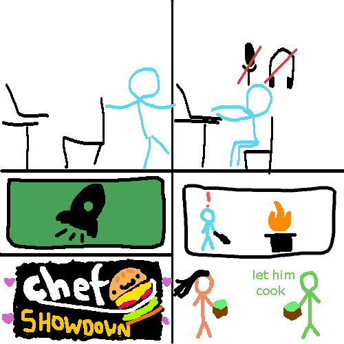
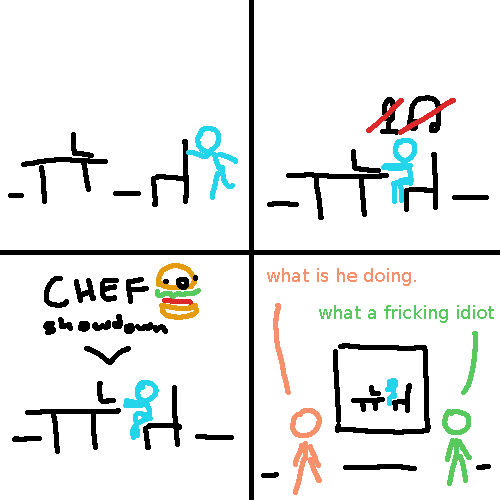
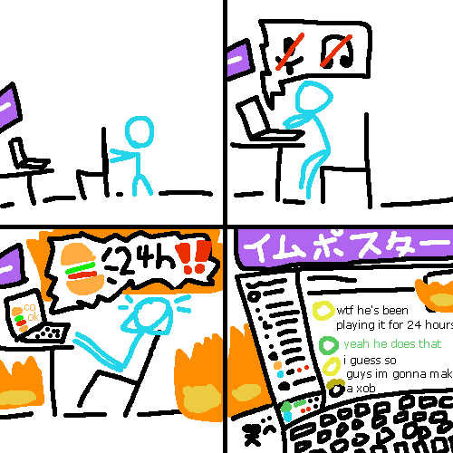
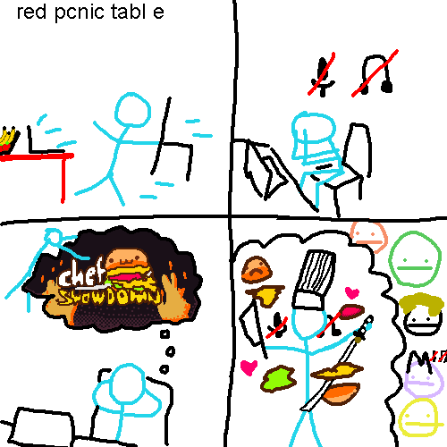
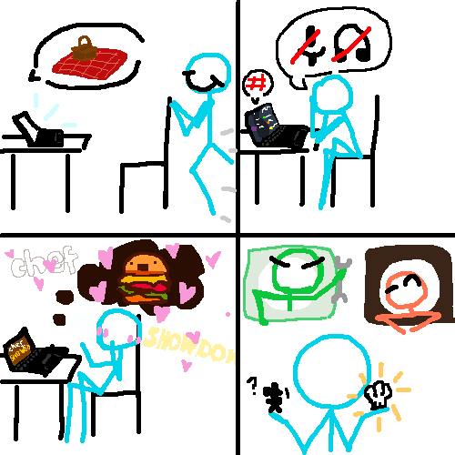

5 Town members, Joel, nottacoz, Loren, notmario, and I (M.spicata) hopped on call one day. And we all ended up drawing the same xob comic. This was the result.

## the original

> no artist statement

## the speedrun

> great to see what interpretations of xobs other people create. ...actually, it's kind of terrifying. also, stop using our calls to cook.

## the marathon

> based on a true story, this "xob" comic shows the tragedy of technology and what it has done to our youths. it shows a person playing a silly video game for 24 hours, wasting his life away. also impostor at the top in katakana

## the layered

> i love dasindu :heart:

## the all of the above

All in all, it was very fun. Which one was your favourite.

[and that too](xobas.md)
